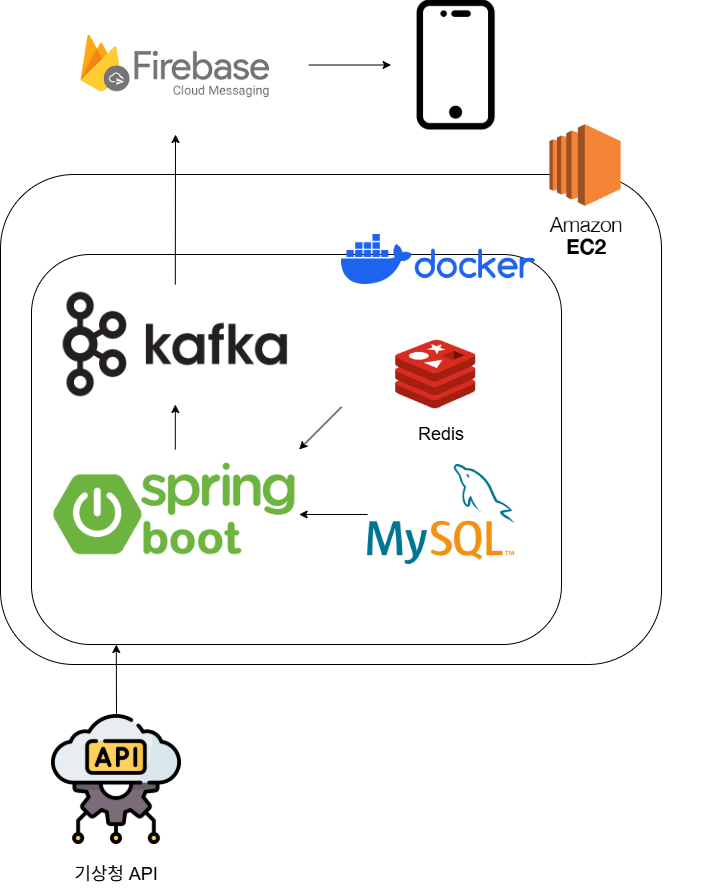
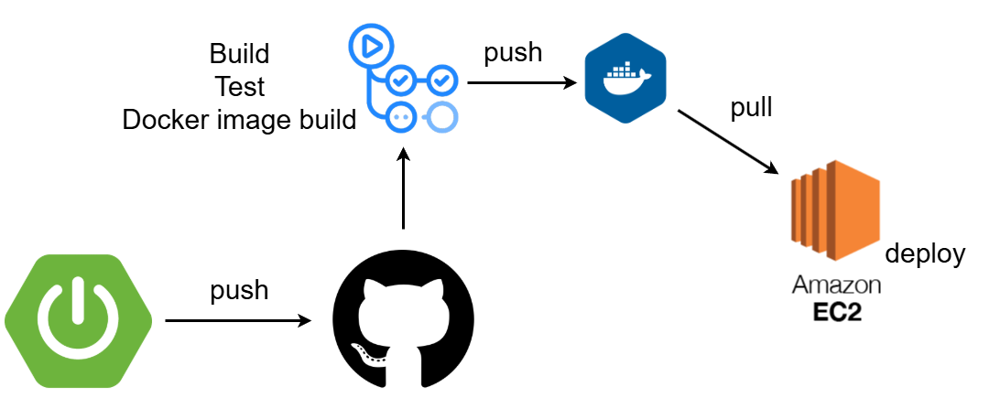
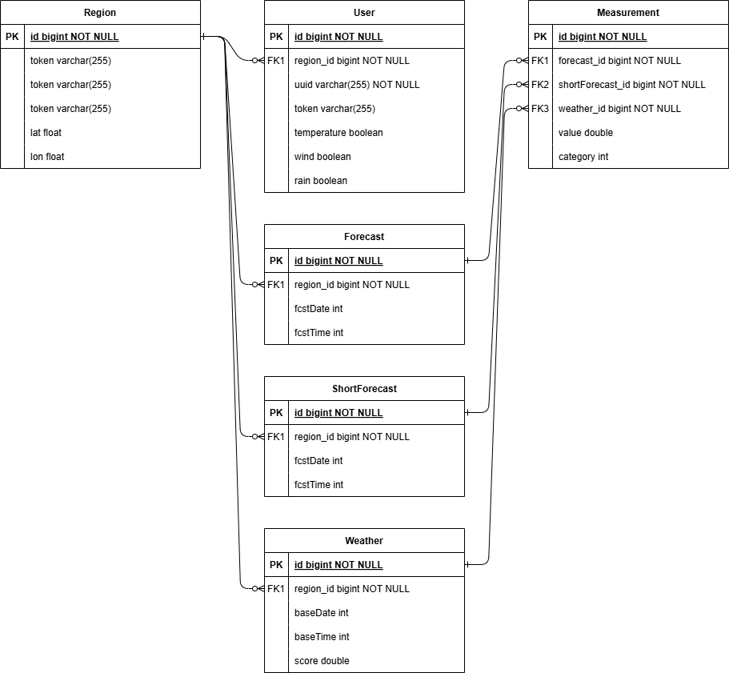
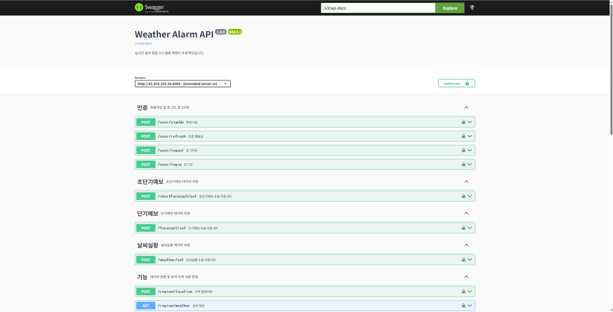

## 프로젝트 설명

**📝 프로젝트 이름**

---
- 날씨 알림 서비스
- 개발 기간: 25.11.22 ~ 25.12.23

 

**📝 프로젝트 배경**

---
기존 날씨앱을 사용하면서 사용자가 원하는 날씨 조건에 맞춰
알림을 설정할 수 있는 기능이 부족하다고 느꼈습니다.

이를 계기로 위치 기반 서비스, 재난 알림, 날씨 정보 제공 기능을
구현하며 각종 기술을 학습하고자 하였습니다.

단순 CRUD 프로젝트를 넘어 
실시간 알림, 비동기 처리, 위치 변경 알고리즘, 사용자 맞춤 알림 설정 등을 
직접 구현해보기 위해 날씨 알림 서비스를 개발했습니다.

 

**🎯 사용 기술**

---
- **Java, SpringBoot, JPA, MySQL, Redis, Spring Security+JWT, Docker, Github Actions, AWS EC2, Kafka, FCM*
  
 

**🎯 주요 기능**

---
- 사용자 위치 기반 날씨 알림 서비스
- 사용자 지역 날씨 제공 및 알림 기능
- 사용자의 기존 지역의 중심 좌표와 사용자 현 좌표 비교 후 4km 이상인 경우 지역 변경 기능
- 사용자 알림 설정 기능
- 동적 SQL을 통한 사용자 알림 필터링 기능
- 재난 지역 알림 기능

 

**🎯 실행 방법**

---
- 실행 서버에 Docker 설치
- /home/ubuntu/app 디렉토리 생성
- 해당 디렉토리에 리포지토리의 compose.yaml 파일 복사
- 해당 디렉토리에 .env 파일 생성
- docker compose up -d 명령어 실행
  
 

**🎯 env 파일 예제**

---
- MYSQL_URL=jdbc:mysql://mysql:3306/weatherdb?useSSL=false&serverTimezone=UTC&allowPublicKeyRetrieval=true
- MYSQL_DATABASE=weatherdb
- MYSQL_USERNAME=root
- MYSQL_PASSWORD=1234
- DOCKER_ID=kcjsend5
- BACKEND=weather
- JWT_SECRET=hs512를 통해 발급한 임의 문자열
- GEO_KEY=네이버 클라우드 역지오코딩 API key
- GEO_SECRET_KEY=네이버 클라우드 역지오코딩 시크릿 API key
- WEATHER_KEY=기상청 API key
  
 

**🚀 시스템 아키텍처**

---

 

## 👥 개발자 소개

---

| 이름  | GitHub 주소                        | 역할             |
|-----|----------------------------------|----------------|
| 정한준 | https://github.com/kcjsend5      | 백엔드 개발, DevOps |
